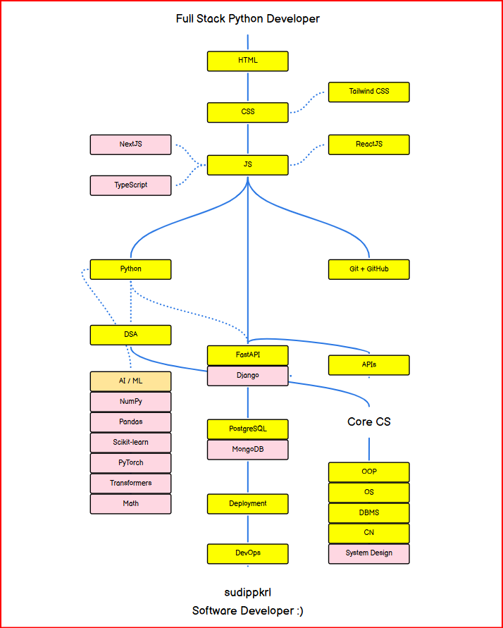

# 🚀 Web Mastery — Full Stack Python Developer Journey

  

  🔗 Roadmap: https://roadmap.sh/r/full-stack-python-developer-with-aiml

---

# 📌 About

This repository contains my structured learning journey for mastering:

- Frontend Development
- Backend Development
- APIs
- Databases
- DevOps
- AI/ML
- Core Computer Science
- Deployment & System Design

The goal of this repo is to track my progress, organize resources, and build projects while learning modern web development with Python.

---

# 🎯 Current Focus

- Learning: HTML + CSS + JS
- Building: Personal Portfolio Website
- Next: ReactJS + Tailwind CSS

---

# 🧠 Learning Roadmap

## 🌐 Frontend
- HTML
- CSS
- JavaScript
- Tailwind CSS
- ReactJS
- NextJS
- TypeScript

## ⚙️ Backend
- Python
- FastAPI
- Django
- REST APIs

## 🗄️ Databases
- PostgreSQL
- MongoDB

## 🧩 Core CS
- DSA
- OOP
- OS
- DBMS
- CN
- System Design

## 📚 DSA
- Arrays
- Strings
- Linked Lists
- Trees
- Graphs
- Dynamic Programming

## 🤖 AI / ML
- NumPy
- Pandas
- Scikit-learn
- PyTorch

## 🚀 Deployment & DevOps
- Git
- GitHub
- Docker
- AWS
- GitHub Actions
- Kubernetes

---

# 🚀 Projects

- Portfolio Website (HTML, CSS, JS) → Building responsive personal site (v1 layout done)

---

# 📈 Progress Tracking

## 📊 Skill-Based Progress Tracker

| Category  | Skill           | Status       | Notes |
|-----------|-----------------|--------------|-------|
| Frontend  | HTML            | Learning     |       |
| Frontend  | CSS             | Learning     |       |
| Frontend  | JavaScript      | Not Started  |       |
| Frontend  | ReactJS         | Not Started  |       |
| Frontend  | Tailwind CSS    | Not Started  |       |
| Frontend  | NextJS          | Not Started  |       |
| Frontend  | TypeScript      | Not Started  |       |
| Backend   | Python          | Not Started  |       |
| Backend   | FastAPI         | Not Started  |       |
| Backend   | Django          | Not Started  |       |
| Backend   | REST APIs       | Not Started  |       |
| Databases | PostgreSQL      | Not Started  |       |
| Databases | MongoDB         | Not Started  |       |
| DevOps    | Git             | Not Started  |       |
| DevOps    | GitHub          | Not Started  |       |
| DevOps    | Docker          | Not Started  |       |
| DevOps    | AWS             | Not Started  |       |
| DevOps    | GitHub Actions  | Not Started  |       |
| DevOps    | Kubernetes      | Not Started  |       |
| AI/ML     | NumPy           | Not Started  |       |
| AI/ML     | Pandas          | Not Started  |       |
| AI/ML     | Scikit-learn    | Not Started  |       |
| AI/ML     | PyTorch         | Not Started  |       |
| Core CS   | DSA             | Not Started  |       |
| Core CS   | OOP             | Not Started  |       |
| Core CS   | OS              | Not Started  |       |
| Core CS   | DBMS            | Not Started  |       |
| Core CS   | CN              | Not Started  |       |
| Core CS   | System Design   | Not Started  |       |

## 🧩 Status System

- Not Started → not touched yet  
- Learning → actively studying / practicing  
- In Progress → building something real  
- Completed → confident and usable skill  
- Paused → temporarily stopped  
- Skipped (Later) → will revisit in future  
- Dropped (Forever) → intentionally ignored  

---

# 🤝 Connect With Me

- 📌 GitHub: https://github.com/sudip-pkrl  
- 🔗 LinkedIn: https://linkedin.com/in/sudippkrl  

---

# ⭐ Support

If you like this Web Mastery journey and want to support my learning path, give this repository a star ⭐
